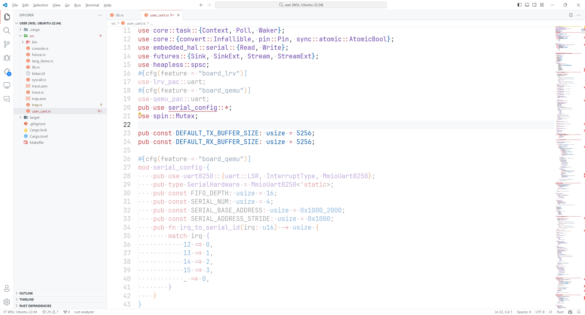

# 过程文档

- 按照[rCore-N仓库](https://github.com/duskmoon314/rCore-N)的README进行带有扩展状态寄存器QEMU的编译安装
    - 在`configure`时，按照[林晨过程文档](https://github.com/BITcyman/Rust-os-learning/blob/main/rCore-N.md)给出的命令：
    ```sh
    ../qemu/configure --target-list="riscv64-softmmu" --extra-cflags=-Wno-error
    ```
- 将编译好的带有扩展状态寄存器的QEMU的`build`文件夹加入环境变量（`PATH`）
- 安装`just`
- 运行
```sh
cd os
LOG=DEBUG just run
```

> 编译错误：
>
> 
>
> 
>
> `rust-analyzer`插件显示，两个条件编译代码块都是灰的，因此出现了未定义变量的错误