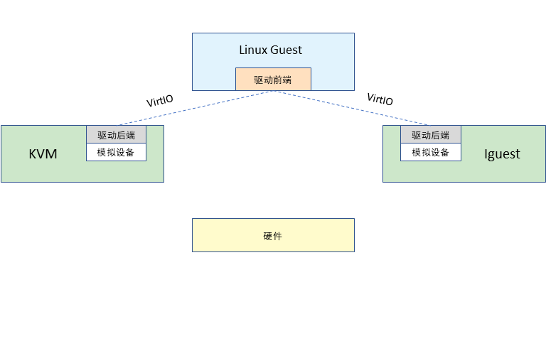
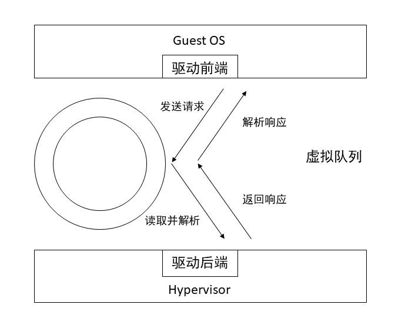

# 跨操作系统的异步音频驱动模块设计与实现

## 摘要

本文提出了一种基于VirtIO协议的跨操作系统的音频驱动模块的设计与实现方案。

在设计方面，使用VirtIO v1.2文档提供的协议接口，利用已有的跨操作系统驱动程序框架virtio-drivers，向其中添加对virtio-sound设备的支持。

在实现方面，充分利用Rust语言的内存安全和高度抽象等特性，使得编写的驱动程序简单易读，同时具有强大的扩展性，即便未来有针对于VirtIO sound设备的功能扩展，此实现也能轻易完成同步更新。在此实现中，没有用到任何与标准库相关联的模块与结构体，即与操作系统无关。因此只需要在对应操作系统源码的Cargo.toml中引入此实现的依赖，使用驱动程序提供的接口，就能完成对VirtIO sound设备的驱动与控制。

## 引言

设备驱动程序是在操作系统和设备之间提供一种接口抽象的特殊软件，它通常运行于操作系统的内核态，以便发出内核态的IO指令，来控制设备读写。实际上，甚至可以说设备驱动程序出现在操作系统之前，那时它们是以可以调用的子程序库的形式存在，例如远古计算机ENIAC需要与磁盘和磁带等外设进行复杂的交互，负责给ENIAC提供这些外设接口的程序，就可以说是对应设备的驱动程序。

传统的驱动程序指的是针对某一物理上真实存在的设备编写的系统软件，但是自从虚拟化的概念出现以后，“驱动程序”这种“驱动某一外设工作的软件”的外沿扩展到了虚拟设备，即通过某些虚拟化技术模拟出来的设备，这些设备在物理上并不存在，例如使用VMware Workstation安装Linux虚拟机时，虚拟机所要面对的底层“硬件”就是通过VMware VMI虚拟化技术模拟出来的“假设备”。

在云计算时代，面对这些虚拟设备并不是一件稀罕的事，Linux内核代码中就有专门为这些虚拟设备编写的驱动程序，这时Linux系统是以Guest OS的形式被用户使用的，如图所示。



在上图中，驱动程序被分为了两个部分——驱动前端（Front-end Drivers）和驱动后端（Back-end Drivers），它们之间使用VirtIO协议进行通信。

驱动后端通常由KVM、QEMU等虚拟化解决方案实现，它为虚拟机（上图中的Linux Guest）提供设备接口，将虚拟机对设备的请求提供到虚拟化框架，并完成对实际物理设备的操作。

驱动前端一般由Guest操作系统实现，例如Linux内核中就包含了针对VirtIO协议实现的驱动前端代码，这里的驱动前端类似传统的驱动程序，它负责给操作系统提供设备接口。

当Guest操作系统要访问外设时，会调用前端驱动提供的接口，前端驱动获取操作系统传来的参数后，基于VirtIO协议与驱动后端进行通信，驱动后端结合虚拟化框架将抽象的设备请求转为具体的、针对宿主操作系统的“真正的”驱动程序的请求，再由这个“真驱动程序”来完成具体的设备操作。

### 背景

正如前文所述，驱动前端一般是由Guest操作系统实现，这就出现了一个问题：Linux内核中实现的VirtIO驱动前端无法在其它操作系统中使用。不仅如此，由于Linux内核使用C语言编写，它的VirtIO驱动大量依赖于Linux内核的其他模块，简单地对这些C代码进行移植是一件十分困难的工作。因此对于一个新开发的操作系统，无法简单地将其作为Guest OS运行在各种虚拟化框架上——因为需要重写各种设备的驱动前端——尽管这是一种“重复造轮子”的工作。

对于某一个版本的VirtIO协议，驱动前端需要实现的操作是固定的，只与VirtIO协议有关，而与操作系统无关，如果每出现一个新的操作系统，就要实现一次已经实现过的驱动前端，对于商业公司和开发人员来说，无疑是一种巨大的资源浪费。

为了减轻开发人员的负担，亟需一种跨操作系统的驱动前端实现，这个实现应该具有“开箱即用、即插即用”的功能，让新操作系统可以快速运行在虚拟化框架上，完成预期功能的验证。

所幸的是，Rust社区已经实现了跨操作系统的驱动前端框架——virtio-drivers。目前实现了console、network、gpu、input、socket、block虚拟设备的驱动，并且有些驱动已经在rCore（一个小的教学操作系统）中得到验证。

本文基于virtio-drivers框架，参考VirtIO v1.2提供的接口，实现了virtio sound虚拟设备的跨操作系统驱动，并且在裸机和rCore中验证了其正确性。

### 毕业设计目标

本毕业设计的预期目标如下：

- 实现virtio sound虚拟设备的跨操作系统驱动前端
- 在裸机上进行正确性验证
- 在rCore上进行正确性验证


## virtio

虚拟化技术的历史远比我们想象的要久远，早在2008年，Linux内核就已经支持了至少8中虚拟化系统，例如KVM，VMware的VMI，用户态Linux等等。虚拟化系统的多样性导致一系列问题出现，尤其是，每种虚拟化解决方案都拥有各自的独特的驱动实现，这对于考虑兼容性的系统无疑是一件十分令人头疼的事。

IBM Ozlabs的Rusty Russell在探索虚拟机中设备驱动程序性能和效率的改进问题时提出了virtio——一系列高效的Linux驱动程序，它们通过一个shim层来适配到各种虚拟化平台。

从Linux内核2.6.25版本开始，virtio驱动就被包括在内核中，并且可以通过内核模块加载进行使用。随着时间的推移，virtio驱动在后续的内核版本中得到了改进和增强，以提供更好的性能和功能。也渐渐地成为了事实上的虚拟IO设备标准（a De-Facto Standard For Virtual I/O Devices）。

### virtio 概述

virtio可以简单地划分为三层，如下图所示。



最上层是前端驱动，运行在Guest OS上，它按照virtio标准规定的格式（主要是结构体字段）对请求封装，通过传输协议将请求发送到后端，同时前端驱动也应具备读取后端发来的响应的功能。

中间层是传输协议，使用虚拟队列（Virtqueue）来完成，对于不同的设备，可能有多个虚拟队列，每个虚拟队列有不同的职责，例如`ontrol_queue`、`event_queue`等。

虚拟队列使用vring来实现，vring本质上是一个环形缓冲区，是Guest OS与Hypervisor之间的一块共享内存，前端负责放入数据，后端负责读取数据。

最下层是后端驱动，由Hypervisor实现，从虚拟队列中接收来自前端的信息，按照virtio标准进行解析，完成对物理设备的操作，再将结果通过虚拟队列返回给前端。

后端驱动主要由Hypervisor实现，超出了这篇文章所要讨论的范围，这里我们主要把目光聚集在前端驱动的实现上。在认识前端驱动之前，首先需要对传输协议——也就是虚拟队列，有一个简单的了解。

### virtio 虚拟队列（Virtqueue）

#### 描述符表（Descriptor Table）

#### 可用环（Available Ring）

#### 已用环（Used Ring）

### virtio 驱动程序组成

## 数字音频基础

```rust
// todo!() 5.6
```

### PCM

### 数字音频基本概念

#### 采样率（Sample Rate）

#### 采样位数（Sample Rate）

#### 声道（Channel）

### ALSA（Advanced Linux Sound Architecture）

#### PCM帧（PCM frame）

#### period

## VirtIO Sound Device分析

```rust
// todo!() 5.7
```

### 虚拟队列（Virtqueues）

### 设备配置空间（Device Configuration Layout）

### PCM生命周期（PCM Lifecycle）

### 设备操作（Device Operation）

#### 配置空间字段查询

#### 插口重新映射（Jack Remap）

#### 设置流（stream）的参数

#### PCM帧的传输

## 实现

```rust
// todo!() 5.8
```

### 整体架构

### 初始化

### 流的基本信息查询

### 插口重新映射

### 设置流的参数

### 流的状态转换

### PCM帧的传输

## 测试

### 裸机下的测试

```rust
// todo!() 5.8
```

### rCore

### Alien

## 未来可能的改进

### 支持VirtIO v1.3

```rust
// todo!() 5.9
```

### 实现异步运行时

## 结论